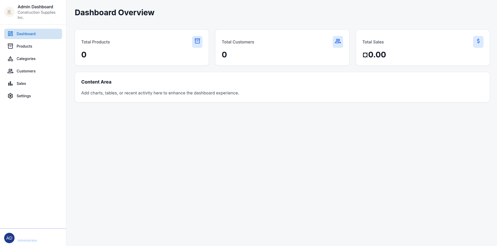

# Firmness

Firmness is a comprehensive web application designed for managing sales, inventory, and customer relationships. It features a robust backend built with .NET Core and a user-friendly frontend for both administration and customer interaction.

## Features

*   **Product Management:** Create, update, delete, and search for products. Manage categories and stock levels.
*   **Customer Management:** Register and manage customer accounts. View customer details and purchase history.
*   **Sales & Orders:** Process sales, generate receipts (PDF), and track order status.
*   **Excel Import:** Bulk upload products and customers using Excel files with AI-powered column mapping correction.
*   **Authentication & Authorization:** Secure login and registration with role-based access control (Admin, Customer).
*   **Dashboard:** Overview of key metrics such as total products, customers, and sales.

## Technology Stack

*   **Backend:** .NET Core 8, Entity Framework Core, SQL Server (or compatible).
*   **Frontend (Web Admin):** ASP.NET Core MVC, Razor Views, Bootstrap/Tailwind CSS.
*   **Frontend (Customer App):** React (planned/integrated).
*   **Libraries:**
    *   `EPPlus`: For Excel file handling.
    *   `QuestPDF`: For generating PDF receipts.
    *   `AutoMapper`: For object-to-object mapping.
    *   `Microsoft.AspNetCore.Identity`: For user authentication and management.

## Getting Started

### Prerequisites

*   .NET 8 SDK
*   SQL Server (LocalDB or full instance)
*   Node.js (for React frontend if applicable)

### Installation

1.  Clone the repository:
    ```bash
    git clone https://github.com/SebastianRdev/Firmness.git
    ```
2.  Navigate to the project directory:
    ```bash
    cd Firmness
    ```
3.  Update the connection string in `.env` to point to your database.
4.  Apply database migrations:
    ```bash
    dotnet ef database update --project Firmness.Infrastructure --startup-project Firmness.WebAdmin
    ```
5.  Run the application:
    ```bash
    dotnet run --project Firmness.WebAdmin
    ```

## Screenshots

### Dashboard

*Overview of the admin dashboard showing key statistics.*

### Product Management

*List of products with search and filter options.*

### Excel Import with AI Mapping

*Bulk upload interface showing AI-suggested column mapping.*

### PDF Receipt

*Sample PDF receipt generated after a sale.*

## Architecture

The solution follows a Clean Architecture approach:

*   **Firmness.Domain:** Core entities and business logic.
*   **Firmness.Application:** Application services, DTOs, and interfaces.
*   **Firmness.Infrastructure:** Data access, external service implementations (Excel, PDF), and repositories.
*   **Firmness.Api:** RESTful API endpoints for the frontend.
*   **Firmness.WebAdmin:** MVC-based administration interface.

## Contributing

Contributions are welcome! Please fork the repository and submit a pull request.

## License

This project is licensed under the MIT License.
